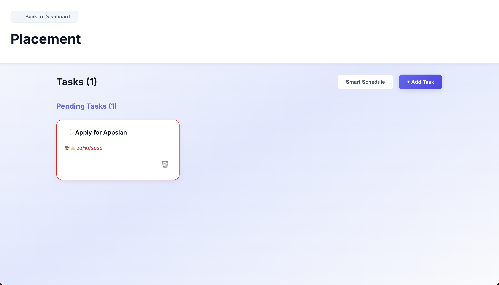

# Project Manager Application

A full-stack project management application with task scheduling and dependency tracking.

## Tech Stack

**Backend:** .NET Core, Entity Framework, SQLite  
**Frontend:** React, TypeScript, Vite

## Features

- User authentication (register/login)
- Create and manage projects
- Add tasks with dependencies
- Smart task scheduler
- Track task completion and progress
- Responsive UI with modern design

## Screenshots

### Login Page


### Register Page


### Dashboard



### Adding Task


### Smart Scheduler


## Setup Instructions

### Backend

```bash
cd backend
dotnet restore
dotnet run
```

Backend runs on `http://localhost:5000`

### Frontend

Open a new terminal:

```bash
cd ui
npm install
npm run dev
```

Frontend runs on `http://localhost:5173`

## Usage

1. Register a new account or login
2. Create a new project
3. Add tasks to your project
4. Set task dependencies and estimated hours
5. Use Smart Schedule to optimize task order
6. Track progress with completion percentages

## API Endpoints

- `POST /api/auth/register` - Register user
- `POST /api/auth/login` - Login user
- `GET /api/projects` - Get all projects
- `POST /api/projects` - Create project
- `GET /api/tasks/{projectId}` - Get project tasks
- `POST /api/tasks` - Create task
- `POST /api/tasks/schedule/{projectId}` - Generate smart schedule
